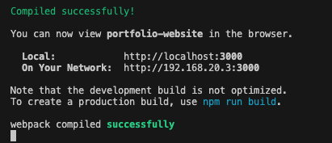

# congenial-doodle
A portfolio of projects using React

## Description

This project is intended to give users a clear view of some projects I have previously built. 

This is intended to be a shortcut for anyone who is interested in viewing my work and seeing what developer skills I have learned recently. 

## Table of Contents

- [Installation](#installation)
- [Usage](#usage)
- [Credits](#credits)
- [License](#license)

## Installation

To install the project, download the application files from the GitHub repository: https://github.com/a-r3n/congenial-doodle

## Usage

To use the application, run 'npm install' and then 'npm start'. 

If the program runs successfully, you will see a message similar to the screenshot below: 

Then head to http://localhost:3000/ to use the application 

## Credits

This project would not have been possible without all of those that worked on free, 3rd party libraries and technologies like Node JS and React. 

Thank you to those that worked on these projects. 

## License

This project has been developed under an MIT License. 

For more information on the license and conditions of use, please refer to the license document in the project's GitHub repository. 